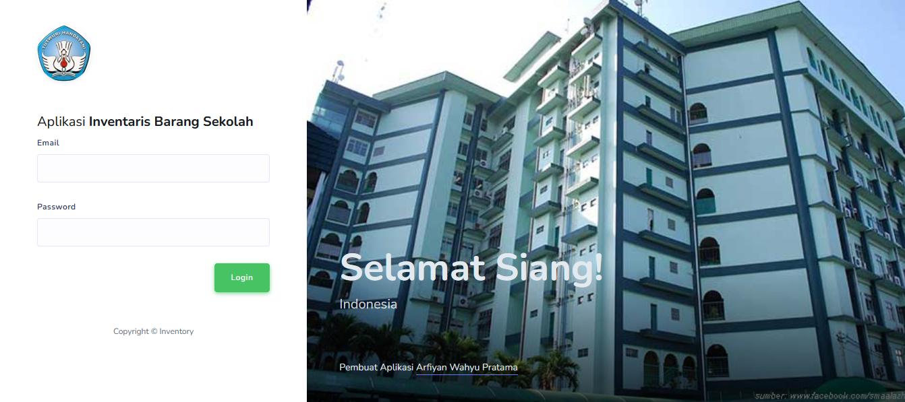
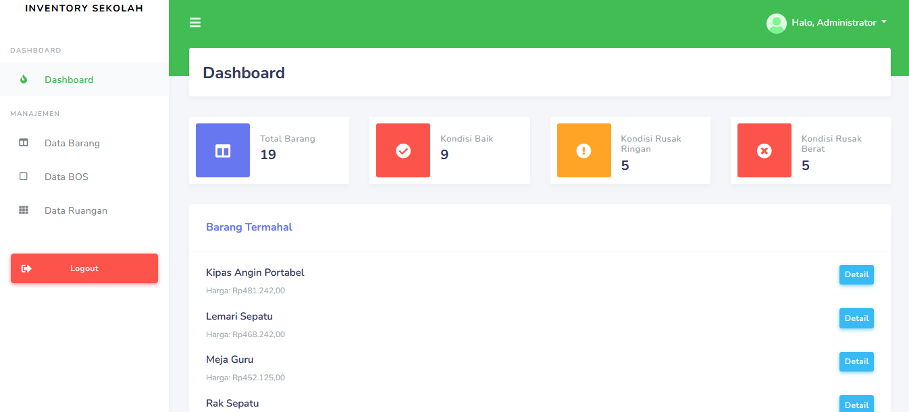
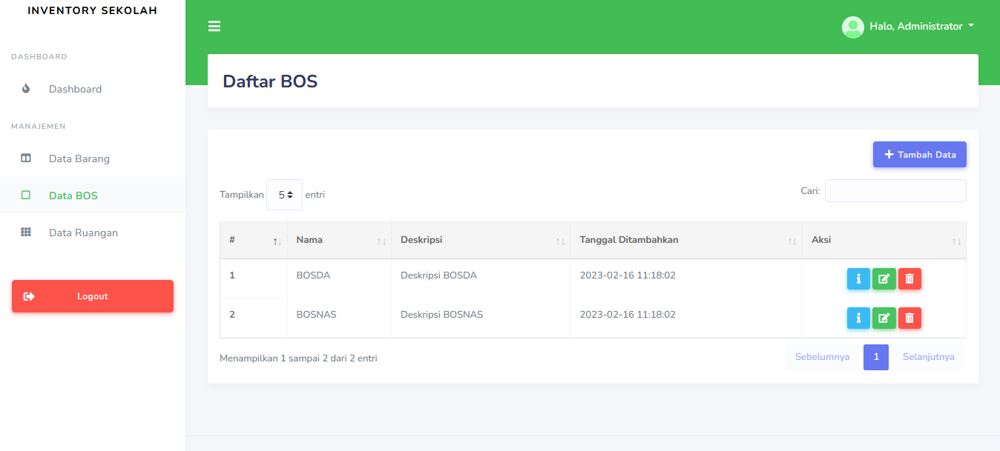
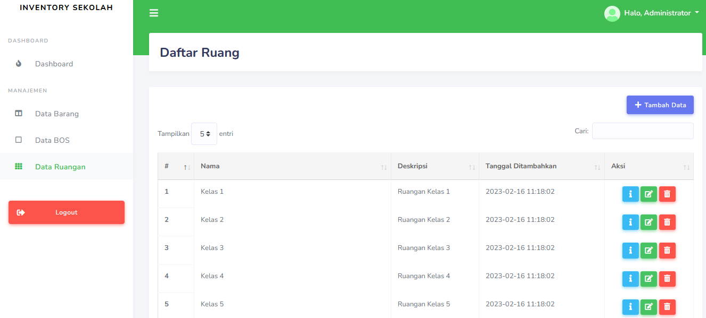

# INVENTORY BARANG SEKOLAH

Aplikasi inventaris barang sekolah menggunakan Framework Laravel 7.

Clone https://github.com/Arfiyan19/Inventory-Sekolah-Laravel.git

### Prasyarat

Berikut beberapa hal yang perlu diinstal terlebih dahulu:

-   Composer (https://getcomposer.org/)
-   PHP 7.2.x
-   MySQL 14.5.x
-   XAMPP

## STEP BY STEP

-   Install seluruh packages yang dibutuhkan

```
composer install
```

-   Siapkan database dan atur file .env sesuai dengan konfigurasi Anda
-   Jika sudah, migrate seluruh migrasi dan seeding data

```
php artisan migrate --seed
```

-   Jalankan local server

```
php artisan serve
```

-   User default aplikasi untuk login

```
Email       : admin@gmail.com
Password    : admin
```

### Fitur

-   CRUD Barang
-   Import/export excel barang
-   Print
-   CRUD BOS (Bantuan Operasional Sekolah)
-   CRUD Ruangan

### Preview Gambar

<br>
<h1>TAMPILAN LOGIN</h1> <br>

 <br><br>

<h1>TAMPILAN DASHBOARD ADMIN</h1> <br>

 <br><br>

<h1>TAMPILAN DAFTAR BARANG</h1> <br>

 <br><br>

<h1>TAMPILAN TAMBAH BARANG</h1> <br>

 <br><br>

<h1>TAMPILAN DAFTAR BOS</h1> <br>

 <br><br>

<h1>TAMPILAN DAFTAR RUANGAN</h1> <br>

 <br><br>
